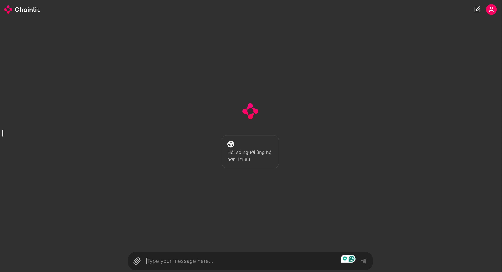

### STATEMENT CHECK

> Note: Only update up to 10/09/2024

#### Installation:

```bash
pre-commit install

pip install -r requirements.txt
```

#### Download data:

```bash
bash download_data.sh
```

#### Database Setup

```bash
docker compose up -d

# Create table
python src/database/run.py --task init

# Insert data
python src/database/run.py --task insert --file_path data/data.csv
```

#### Run Chainlit App

```bash
chainlit run chainlit.py
```

Start Screen:



Chat Screen:


